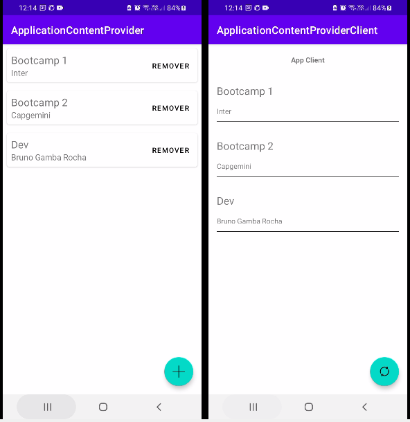
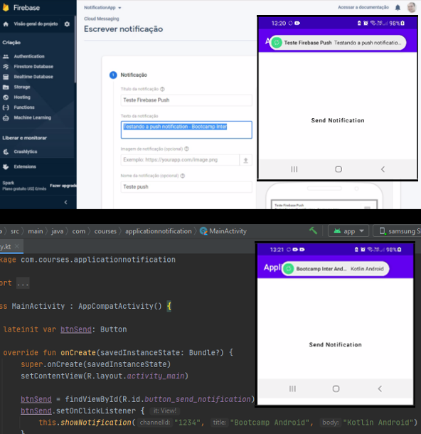
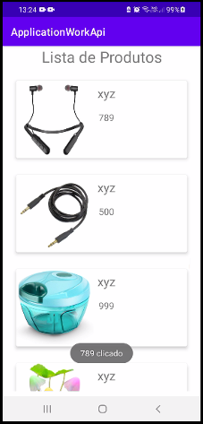

# Kotlin Practise Integrated Apps

- Instrutor: Pedro Luis Martins Coelho
- Plataforma de Ensino: https://digitalinnovation.one/sign-up?ref=K5EF2VCVKA
- Módulo Desenvolvimento Integrado de Aplicações Android
- Repositórios Originais:
	- ApplicationContentProvider: https://github.com/pedroluis-12/ApplicationContentProvider.git
	- ApplicationContentProviderClient: https://github.com/pedroluis-12/ApplicationContentProviderClient.git
	- ApplicationNotification: https://github.com/pedroluis-12/ApplicationNotification.git
	- ApplicationWorkApi: https://github.com/pedroluis-12/ApplicationWorkApi.git

	

## Vídeo Explicativo

- ApplicationContentProvider e ApplicationContentProviderClient
  [Youtube](https://youtu.be/f3UR97eO660)

- ApplicationNotification
  [Youtube](https://youtu.be/AU7OOtGRKBI)

- ApplicationWorkApi
  [Youtube](https://youtu.be/tCaRMTa8qzI)

  

##  Objetivo

- Aplicações destinadas à prática do módulo Desenvolvimento Integrado de Aplicações Android. 

  

## Tecnologias Utilizadas
- Kotlin
- TypeScript

	- App Content Provider
		- ContentProvider
		- ContentValues
		- ContentResolver
		- UriMatcher
		- LoadManager
		- SQLiteDatabase / SQLiteOpenHelper
		- Material
	
	- App Content Provider Client
		- Uri
		- ContentResolver

	- App Notification	
		- Google Firebase (bom / analytics / messaging)
		- NotificationChannel
		- NotificationManager
		- PendingIntent
		
	- App Work Api
		- Retrofity
		- Glide (loading img background)
		- Android Permission
		- SerializedName from gson

		

## Conteúdo apresentado

- Compartilhar dados com outras aplicações pelo ContentProvider
- Receber notificações no dispositivo, localmente e remotamente
- Apresentar dados recebidos de uma api

## Autor

- Bruno Gamba Rocha
- https://www.linkedin.com/in/bruno-gamba-rocha/